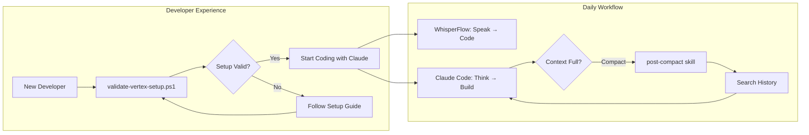
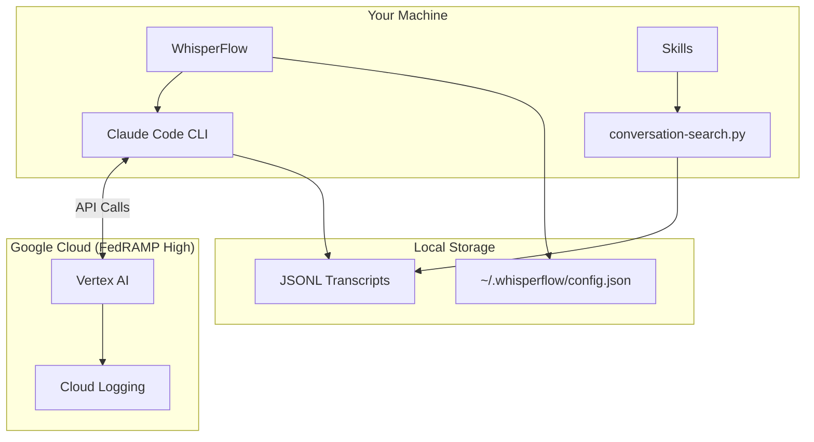
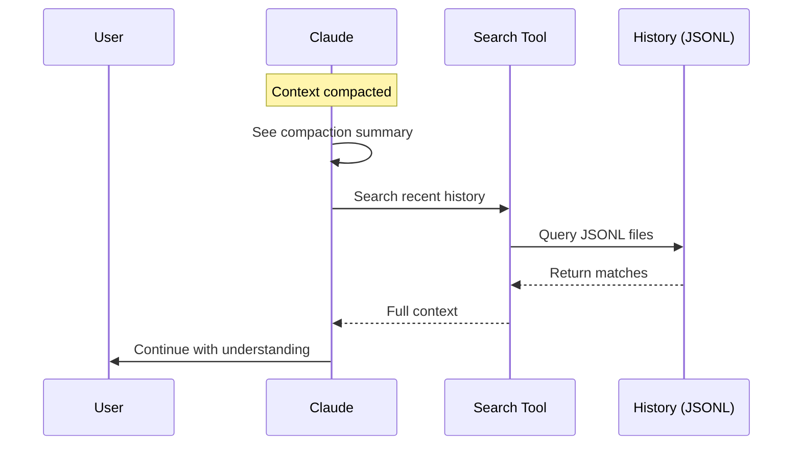
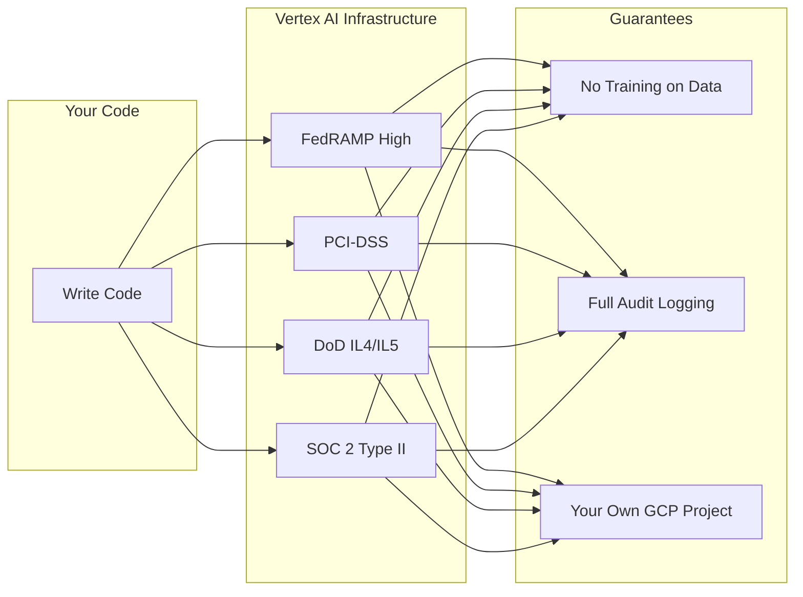

# dev-experience

Developer experience tools for working with Claude Code on compliant infrastructure.

## Purpose

This repo solves three problems:

1. **Onboarding** - Get developers set up with Claude Code + Vertex AI in minutes
2. **Productivity** - Speech-to-text and conversation search for faster coding
3. **Continuity** - Never lose context after compaction or across sessions



## Quick Start

### 1. Validate Your Setup

```powershell
.\setup\windows\validate-vertex-setup.ps1
```

```
SUCCESS: Your setup is configured for FedRAMP-compliant Vertex AI!

You are inferencing from:
  - Project: licensecorporation-dev
  - Region: us-east5
  - Provider: Google Cloud Vertex AI (FedRAMP High)
```

### 2. Start WhisperFlow

```powershell
cd whisperflow && pip install -r requirements.txt && python run.py
```

Press `Ctrl+Shift+Space` → Speak → Text appears at cursor.

### 3. Use Claude Code

```bash
claude
```

Skills are automatically available:
- **search-history** - Find past discussions
- **post-compact** - Recover context after compaction

## Architecture



## How Context Recovery Works

When context gets compacted, Claude doesn't just read the summary - it recovers full context:



**Result**: Within 3-5 tool uses, Claude is fully up to speed on:
- What was being worked on
- Decisions that were made
- Files that were modified
- Problems that remain open

## Components

| Component | Purpose | Usage |
|-----------|---------|-------|
| `validate-vertex-setup.ps1` | Confirm FedRAMP/PCI/DoD compliance | Run once after setup |
| `whisperflow/` | Speech-to-text service | `Ctrl+Shift+Space` to toggle |
| `conversation-search.py` | Search JSONL history | `python conversation-search.py "term"` |
| `skills/search-history/` | Claude auto-searches past | Automatic |
| `skills/post-compact/` | Recover context after compact | Automatic |

## Compliance

Infrastructure handles compliance - you just code:



| Framework | Status |
|-----------|--------|
| FedRAMP High | Authorized |
| PCI-DSS | Compliant |
| DoD IL4/IL5 | Eligible (us-east5) |
| SOC 2 Type II | Compliant |
| Data used for training | **Never** |

## Directory Structure

```
dev-experience/
├── setup/
│   └── windows/
│       └── validate-vertex-setup.ps1    # Validate compliance
├── whisperflow/                          # Speech-to-text
│   ├── main.py
│   ├── transcriber.py                   # Whisper integration
│   └── utils/config.py                  # Custom vocabulary
├── services/
│   ├── conversation-search.py           # Search JSONL
│   └── config.py                        # Auto-discovery
├── skills/
│   ├── search-history/                  # Find past discussions
│   │   └── SKILL.md
│   └── post-compact/                    # Context recovery
│       └── SKILL.md
└── docs/
    └── claude-code-vertex-setup.md      # Full setup guide
```

## Custom Vocabulary

WhisperFlow recognizes technical terms via `~/.whisperflow/config.json`:

```json
{
  "custom_vocabulary": "Claude Code, FedRAMP, PCI-DSS, Vertex AI, Bazel, ..."
}
```

Add your project-specific terms for better transcription.

## Contributing

1. Clone the repo
2. Run validation script
3. Test WhisperFlow
4. Test search-history skill
5. Submit PRs for improvements

## Full Setup Guide

See [docs/claude-code-vertex-setup.md](docs/claude-code-vertex-setup.md) for complete installation.

## License

MIT
